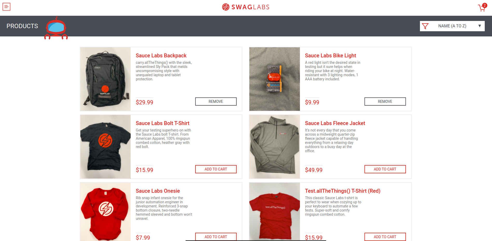
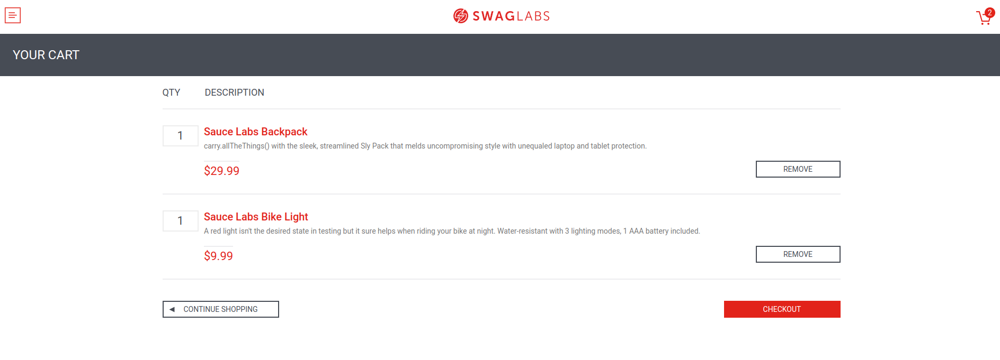
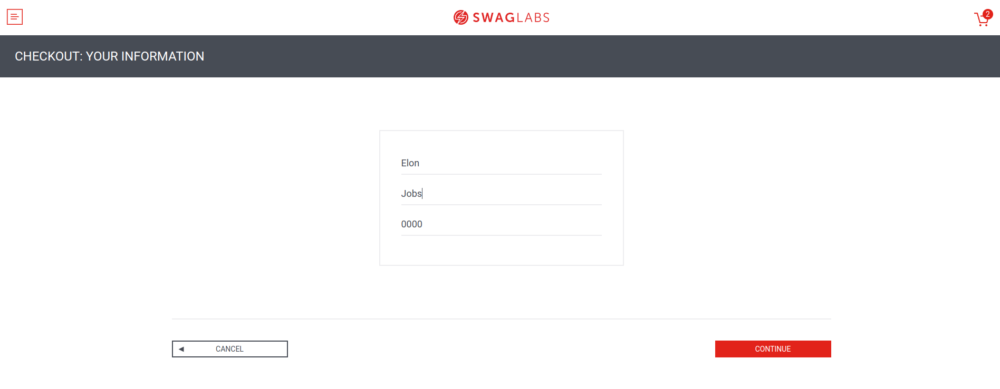
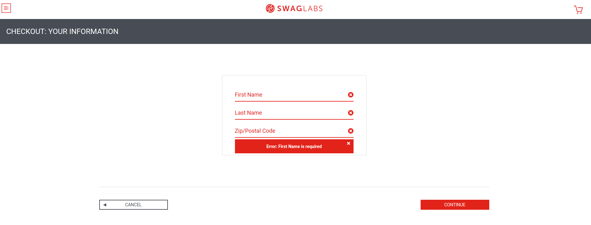
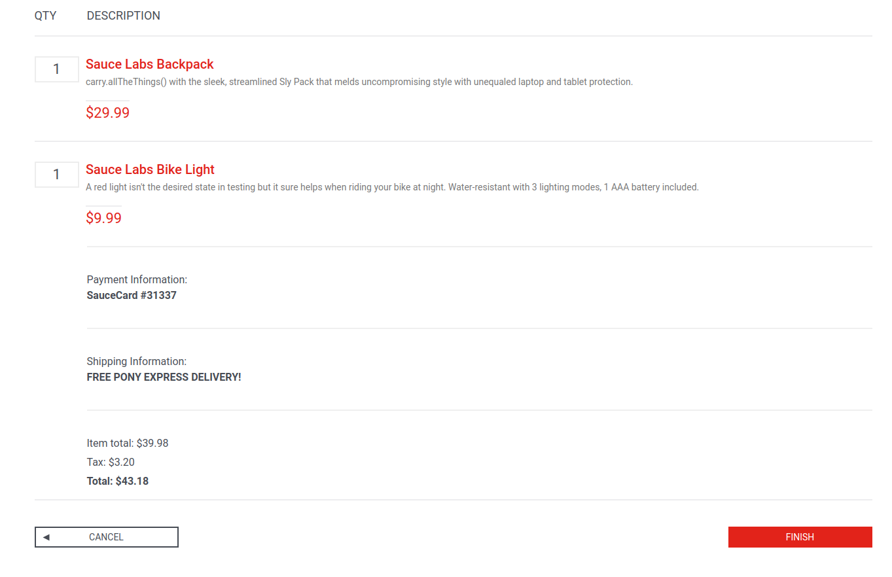
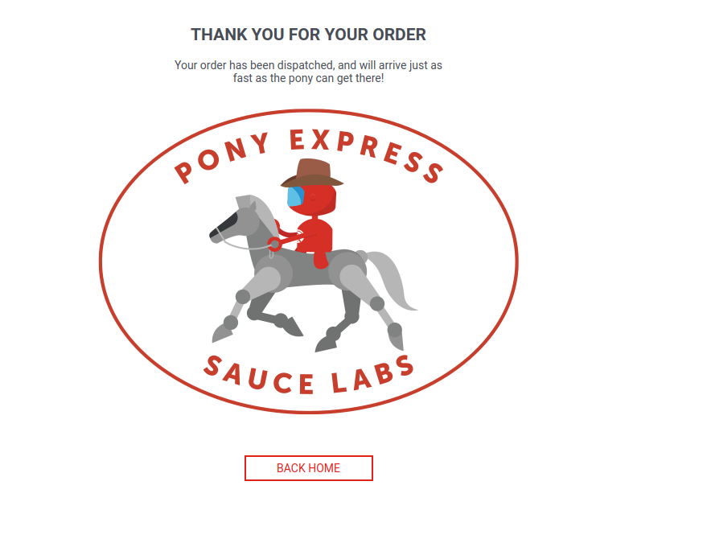

# Presentation

The aim of this test is to evaluate your knowledge on planning use cases and writing automation scripts. To do so, you will have a practical exercise to complete. The understanding of your thinking and the quality of your code will be as important as the result itself.

You will have at your disposition a user story, some mockups and acceptance criteria that can be tested on the following [Ecommerce Demo site](https://www.saucedemo.com/).

You are free to present your answers as you see fit and complete missing elements by yourself. For the coding part, you are free to use any coding language you want (preferably javascript or JAVA).

Please send us the work for the following points :

* Enumerate the uses cases that comes to your mind when reading the user stores

* Write the test scenarios you think of

* Define the data set you will need for your test cases

* Write the automation scripts :

	* Comments you will add in your code will help us understand how you built the test.

	* Add inside README file all the needed commands to execute your test on a linux / windows  local environment.

## How to send your code?  

* Fork the Github repository into your own **private** personal repository in **in Github**

* Push your code / docs into a new branch with the following name:
  * firstname_lastname
  
  * please use snake case format

*  Invite your reviewers as as **Collaborator**
  * open the following menu menu: **Settings  > Collaborators**
  * click on **Add people** button
  * add cherniMaher, maher.cherni@adad.io

* Create a new pull request and set **cherniMaher** , **maher.cherni@adad.io** as Reviewer

**Good luck !**

# User story
As a registered buyer, I can checkout items selected in my shopping cart so that I can complete my purchase.

## Steps
* Log into the site (using the following credentials: standard_user/secret_sauce)

* Sort the items (Lowest Price sort)

* Add two or more items to the shopping cart

* Visit the shopping cart

* Assert that the items that I added in the cart are correct

* fill Checkout details

* Assert I am purchasing the correct items

* Assert the total price

* Finish checkout

## Acceptance criteria
* First name, last name and Zip/Postal code are required when completing checkout information

* Checkout overview page should display Cart total amount which is calculated as follows:

  * Total = item total + tax

  * item total =  Σ item price * quantity

  * tax = item total * 8%

* When the checkout is complete, the cart is set back to empty

# Mockups

Login page

Inventory page - empty cart

Inventory page - some items selected

Cart detail page

Checkout information page

Checkout information page - required fields validation

Checkout Completion page

Thank you page
